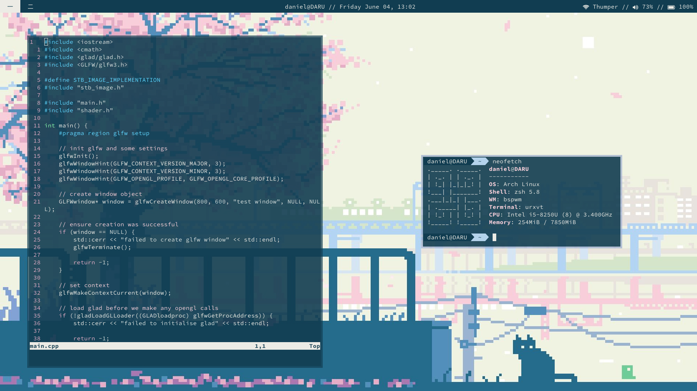

# dotfiles
config files for my archlinux install. will update as i change my setup, mostly here so i can keep configs consistent between my desktop and laptop but anyone is more than welcome to use these configs as they please.

## the stuff i use
- **os:** archlinux
- **wm:** i3-gaps
- **bar:** polybar
- **launcher:** rofi
- **notifications:** dunst
- **compositor:** compton

## screenshots
### busy

### clean

